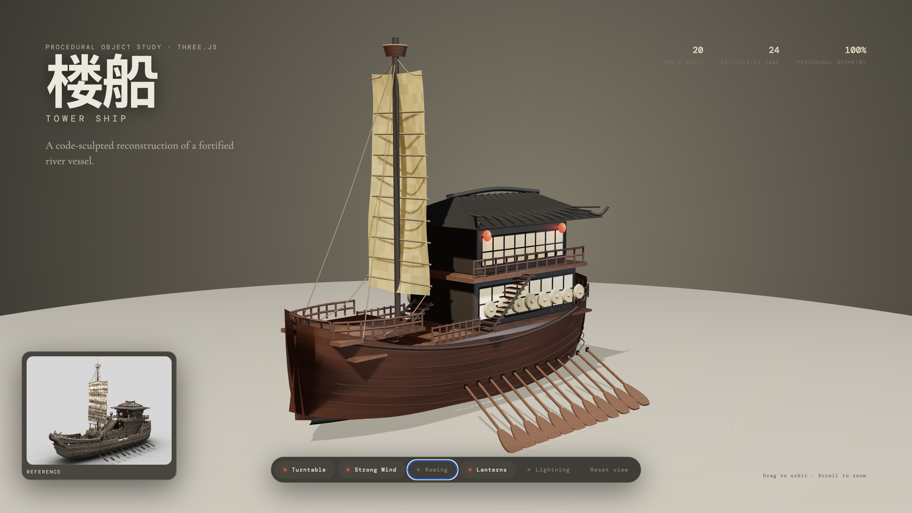
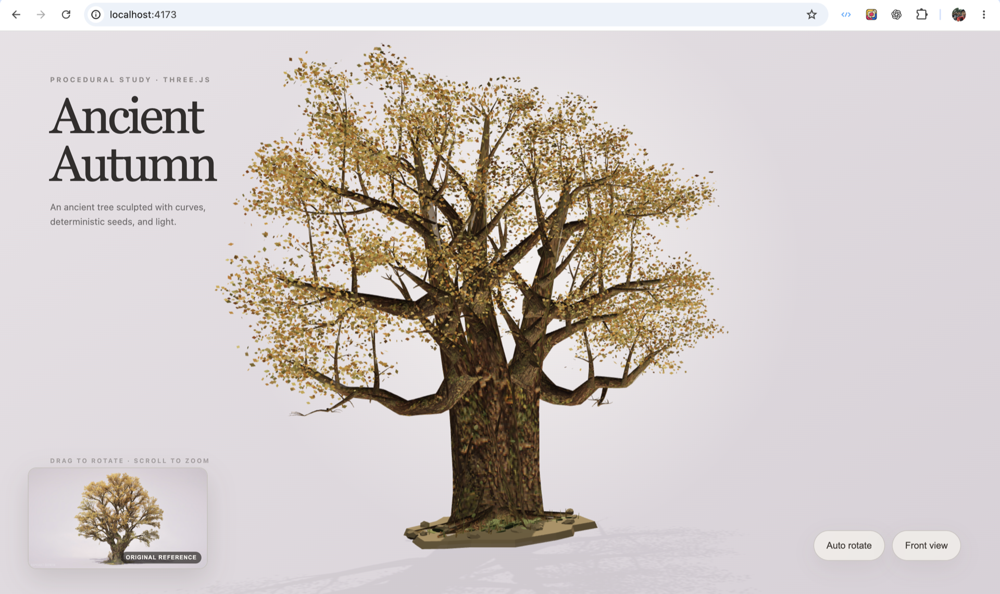
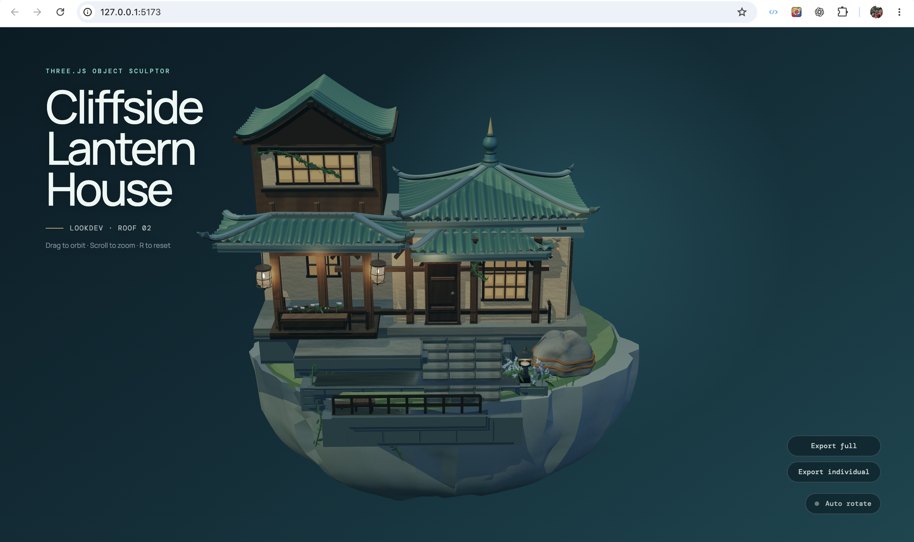

# img2obj

Turn a reference image into a quality-gated, animation-ready procedural Three.js object—built entirely with code.

[img2obj](https://github.com/vinhhien112/img2obj) is a Codex plugin that helps analyze an object image, plan its structure, generate procedural Three.js geometry, and review the result against the original reference.

## Demo

### Tower Ship

[Open the live Tower Ship demo](https://3dship.harrysoftware.com)



This study demonstrates procedural geometry, articulated parts, material work, and interactive browser controls.

### Ancient Autumn Tree

[Open the live Ancient Autumn Tree demo](https://tree.harrysoftware.com/)



This study demonstrates procedural curves, deterministic branching, layered bark, dense foliage, and an animation-ready hierarchy.

### Cliffside Lantern House — Unreleased Preview

> [!NOTE]
> This is a preview created with an unreleased version of img2obj. It will be updated in future versions.



## At a Glance

| | |
|---|---|
| **Input** | An attached object image, screenshot, or local image path |
| **Output** | An `ObjectSculptSpec` and a code-only procedural Three.js factory |
| **Goal** | Recreate the visible silhouette, structure, materials, and motion-ready hierarchy |
| **Best for** | Stylized props, mechanical objects, plants, scene assets, and interactive models |
| **Not for** | Photogrammetry, exact mesh extraction, or guaranteed production-ready geometry from one image |

img2obj does not convert pixels directly into a finished mesh. It guides Codex through a controlled reconstruction workflow so that the most recognizable parts of the reference are planned, built, compared, and refined deliberately.

## How It Works

1. **Validate the reference** — check image quality, object visibility, complexity, and whether a cleaner source image is needed.
2. **Plan the object** — describe the component hierarchy, geometry, materials, pivots, sockets, and visual priorities in an `ObjectSculptSpec`.
3. **Build in phases** — progress through `blockout → form → lookdev → interaction`, keeping later details out of earlier passes.
4. **Review and refine** — compare browser renders with the active source image, fix the highest-impact differences, and require approval before advancing.

## Core Capabilities

- Validates whether a reference is suitable for procedural 3D reconstruction.
- Breaks complex objects into assemblies, parts, visible details, and material systems.
- Generates procedural Three.js geometry instead of downloading meshes or art packs.
- Supports hard-surface, organic, vegetation, fabric, glass, hair/fur, emissive, and decal-oriented capability packs.
- Plans pivots, sockets, parent-child relationships, detachable parts, and other animation-ready anchors.
- Extracts reference-derived PBR evidence such as palette, roughness, height, normal, and ambient-occlusion maps.
- Packages reference and render screenshots for visual comparison and quality review.
- Rejects unsupported geometry or unverified corrections instead of silently substituting guessed output.

## Requirements

- Codex with local plugin support.
- Python 3.10 or newer.
- A browser project using Three.js for the generated object factory.
- AI image and vision access when source cleanup, planning views, or visual review are needed.

## Install

Clone the current source:

```bash
git clone https://github.com/vinhhien112/img2obj.git
cd img2obj
python3 scripts/sculpt.py --help
```

## Quick Start

After loading the repository as a local Codex plugin, attach an object image and ask:

```text
Use img2obj to turn the object in this image into a procedural Three.js model built entirely with code.
```

Add motion requirements only when needed:

```text
Make the visible hatch open on its hinge. Do not add physics or destruction.
```

The default workflow validates the image, builds a structured spec, converges the silhouette, adds form and materials, assesses interaction needs, and reviews the final browser render against the reference.

## CLI Workflow

Use the unified `sculpt.py` entry point for new work:

```bash
python3 scripts/sculpt.py init "Ancient Autumn Oak" \
  --image ./reference/oak-tree.png \
  --reference-separation clear \
  --complexity complex \
  --out object-sculpt-spec.json

python3 scripts/sculpt.py context object-sculpt-spec.json

python3 scripts/sculpt.py validate object-sculpt-spec.json \
  --for-pass blockout \
  --strict-quality

python3 scripts/sculpt.py generate object-sculpt-spec.json \
  --out src/AncientOak.generated.ts \
  --wrapper-out src/AncientOak.ts
```

Run `python3 scripts/sculpt.py --help` to explore comparison, review, correction, capability, probe, and PBR commands. Older individual scripts remain available for compatibility.

## Quality Model

img2obj evaluates two complementary layers:

- **Overall identity:** silhouette, proportions, camera, materials, and lighting.
- **Critical features:** the small set of parts that makes the object recognizable, such as a roof profile, branch fork, wheel cluster, face, or hand-to-object contact.

A high overall score cannot hide a failed critical feature. Active phases also require visual evidence and explicit user approval before the workflow advances.

## What img2obj Produces

- A structured `ObjectSculptSpec` describing geometry, materials, hierarchy, motion, and review targets.
- A generated TypeScript factory for the currently unlocked sculpt phase.
- Comparison sheets and evidence manifests for visual review.
- Optional procedural PBR maps and look-development helpers.
- Review history and phase checkpoints for refinement, promotion, or rollback.

## Limitations

- One image cannot reveal hidden sides or exact dimensions.
- The result is a procedural approximation, not a scanned or extracted mesh.
- Transparent glass, smoke, liquid, fur, fine cloth, and exact likeness may need more references or a lower-fidelity target.
- The generated factory is a construction starting point, not a replacement for a complete production asset pipeline.
- AI vision review is required for visual acceptance; local scripts organize evidence but do not judge similarity by themselves.

## Project Layout

```text
.codex-plugin/plugin.json
skills/object-to-threejs-procedural/
scripts/
tests/
assets/
```

- `skills/object-to-threejs-procedural/` contains the Codex workflow and reference contracts.
- `scripts/sculpt.py` is the recommended command entry point.
- `scripts/` contains validators, generators, visual-review tools, and compatibility commands.
- `tests/` contains the Python regression suite.

## Development

Run the test suite after changing workflow contracts or scripts:

```bash
python3 -m unittest discover -s tests
```

Reload the local plugin after changing its skill, scripts, or manifest so a new Codex task receives the latest version.

## Support

If img2obj is useful to you, you can support its continued development:

<a href="https://ko-fi.com/harrynguyen112">
  
</a>

## License

[MIT](LICENSE)
